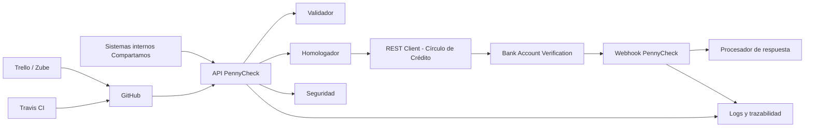

# PennyCheck
## API de validación bancaria con Círculo de Crédito

---

# Resumen ejecutivo

**PennyCheck** es una API empresarial desarrollada en **Java 21 + Quarkus** para **Compartamos Servicios**, diseñada para desacoplar e integrar el consumo del servicio **Bank Account Verification** de **Círculo de Crédito**.

Su propósito es permitir a los sistemas internos de Compartamos **validar cuentas bancarias antes de ejecutar operaciones financieras sensibles**, mediante una capa segura, trazable, escalable y mantenible.

La solución recibe solicitudes internas, valida la información, transforma el modelo de datos institucional al formato requerido por el proveedor externo, consume el servicio y recibe resultados posteriores mediante un **webhook seguro**.

---

# Descripción

Este repositorio contiene la solución para el sistema **PennyCheck**.

Su objetivo principal es permitir a los sistemas internos de **Compartamos Servicios** realizar el proceso de **validación bancaria previa a operaciones financieras** de forma eficiente, segura y escalable.

La arquitectura fue diseñada bajo principios de:

- Bajo acoplamiento
- Seguridad por diseño
- Trazabilidad
- Integración desacoplada
- Escalabilidad
- Mantenibilidad

---

# Problema identificado

Actualmente, Compartamos Servicios requiere consumir el servicio **Bank Account Verification** de Círculo de Crédito; sin embargo, esto presenta varios retos:

- Diferencias entre la estructura interna y externa de datos
- Nomenclatura distinta de campos
- Flujo de respuesta asíncrono
- Requerimientos estrictos de seguridad
- Necesidad de trazabilidad de extremo a extremo

Esto provoca:

- Riesgo de errores de integración
- Mayor complejidad técnica
- Baja reutilización
- Dificultad para mantenimiento
- Menor control de auditoría

---

# Solución

La solución propuesta consiste en una **API empresarial REST desarrollada en Quarkus**, que permite:

- Automatizar la validación bancaria
- Centralizar la integración con Círculo de Crédito
- Homologar la información institucional
- Mejorar seguridad y trazabilidad
- Facilitar despliegues y mantenimiento
- Preparar futuras extensiones funcionales

---

# Arquitectura

La solución está compuesta por:

- **Cliente consumidor:** Sistemas internos Compartamos
- **Backend / API:** Java 21 + Quarkus
- **Integración externa:** REST Client hacia Círculo de Crédito
- **Webhook:** Callback seguro para recepción de resultados
- **Infraestructura CI/CD:** GitHub + Travis CI
- **Gestión del proyecto:** Trello / Zube
- **Control de versiones:** Git Flow (`develop` / `master`)

---

# Diagrama de arquitectura



---

# Tabla de contenidos

- [Resumen ejecutivo](#resumen-ejecutivo)
- [Requerimientos](#requerimientos)
- [Instalación](#instalación)
- [Configuración](#configuración)
- [Uso](#uso)
- [Contribución](#contribución)
- [Roadmap](#roadmap)
- [Wiki del proyecto](#wiki-del-proyecto)

---

# Requerimientos

## Infraestructura

- **Servidor de aplicación:** Quarkus Embedded Server
- **Servidor web:** No aplica (embebido en Quarkus)
- **Base de datos:** No aplica en v1
- **Sistema operativo recomendado:** Ubuntu / Windows / macOS

## Software y dependencias

- **Java:** 21
- **Maven:** 3.9+
- **Git:** 2.40+
- **Travis CI:** Pipeline configurado
- **Docker:** opcional en roadmap

## Paquetes principales

- Quarkus REST
- Quarkus REST Client
- Quarkus Jackson
- Quarkus JUnit5
- RESTEasy Reactive
- SmallRye Config

---

# Instalación

## Clonar repositorio

```bash
git clone https://github.com/tu-org/pennycheck.git
cd pennycheck
```

---

## Variables de entorno

```env
APP_PORT=8080
CDC_BASE_URL=https://services.circulodecredito.com.mx
CDC_API_KEY=4wHrJrmH6iT4VQfKy3oy6GKKwYb7x1OZ
WEBHOOK_TOKEN=secure_token
LOG_LEVEL=INFO
```

---

## Instalar dependencias

```bash
./mvnw clean install
```

---

## Ejecutar ambiente de desarrollo

```bash
./mvnw quarkus:dev
```

La API quedará disponible en:

```text
http://localhost:8080
```

---

# Pruebas manuales

## Flujo funcional

1. Iniciar la aplicación
2. Consumir endpoint principal
3. Validar request
4. Simular respuesta de proveedor
5. Consumir webhook

## Validar

- Recepción de request
- Validación de campos
- Homologación correcta
- Consumo externo
- Recepción de callback
- Logs de correlación
- Seguridad básica

---

# Pruebas automatizadas

```bash
./mvnw test
```

---

# Despliegue

## Producción local

```bash
./mvnw clean package
java -jar target/quarkus-app/quarkus-run.jar
```

---

## Docker (roadmap)

```bash
docker build -t pennycheck .
docker run -p 8080:8080 pennycheck
```

---

# Configuración

## Archivos principales

```text
src/main/resources/application.properties
.travis.yml
README.md
```

## Ejemplo

```properties
quarkus.http.port=8080
quarkus.rest-client.cdc.url=${CDC_BASE_URL}
quarkus.log.level=${LOG_LEVEL:INFO}
```

```payload
"subscriptionId":48e202d5-9014-439a-8a90-fb7c6d2f0207
```

---

# Validaciones previas

Antes de ejecutar:

- Java 21 instalado
- Variables de entorno configuradas
- Puerto 8080 disponible
- Credenciales válidas de Círculo de Crédito
- Wrapper Maven generado
- Travis habilitado en el repositorio

---

# Uso

## Referencia para usuario consumidor

Los sistemas internos pueden:

- Solicitar validación bancaria
- Consultar respuesta técnica
- Recibir resultado homologado
- Consumir estatus del proceso

---

## Endpoint principal

```text
POST /sandbox/v1/bavs/accountValidator
```

## Webhook

```text
POST /api/v1/pennycheck/webhook
GET  /sandbox/v1/bavs/accountValidator/{inquiryId}
```

---

# Contribución

## 1. Clonar repositorio

```bash
git clone https://github.com/tu-org/pennycheck.git
cd pennycheck
```

## 2. Crear nueva rama

```bash
git checkout -b feature/nombre-cambio
```

## 3. Guardar cambios

```bash
git add .
git commit -m "feat: descripción breve del cambio"
```

## 4. Subir rama

```bash
git push origin feature/nombre-cambio
```

## 5. Enviar Pull Request

Abrir Pull Request hacia:

- `develop` → cambios de desarrollo
- `master` → liberación GA

## 6. Esperar revisión y merge

- Atender comentarios
- Ajustar cambios
- Validar Travis CI
- Merge al aprobarse

---

# Roadmap

- [ ] Contrato con CDC
- [ ] Registro en el API Manager de CDC
- [ ] Registro de Webhook en el Webhook Manager de CDC
- [ ] Cobertura de pruebas > 80%
- [ ] OAuth2 / SSO
- [ ] Panel de monitoreo
- [ ] Métricas Prometheus
- [ ] Retry policy avanzada
- [ ] Multiambiente DEV / QA / PROD
- [ ] Alta disponibilidad

---

# Wiki del proyecto

## Documentación técnica sugerida

- Arquitectura detallada
- Contrato request / response
- Tabla de homologación de campos
- Seguridad del webhook
- Convención de ramas
- Estrategia CI/CD
- Manual de despliegue

---

# Estado del proyecto

🚧 **Finalizado – Milestone QA**

Ramas principales:

- `develop`
- `master`

CI:

- Travis CI habilitado

Gestión:

- Trello / Zube

---

# Licencia

Uso académico y empresarial interno para **Compartamos Servicios** y **Tecmilenio**.
